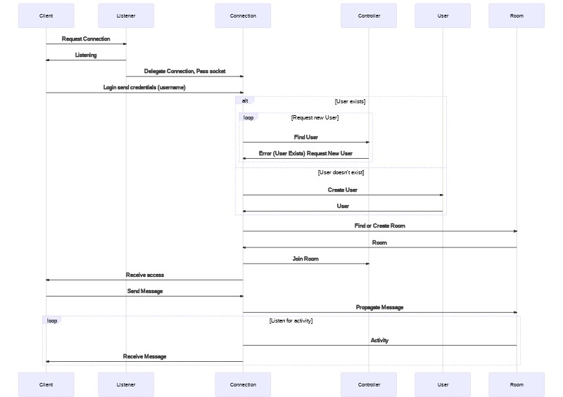
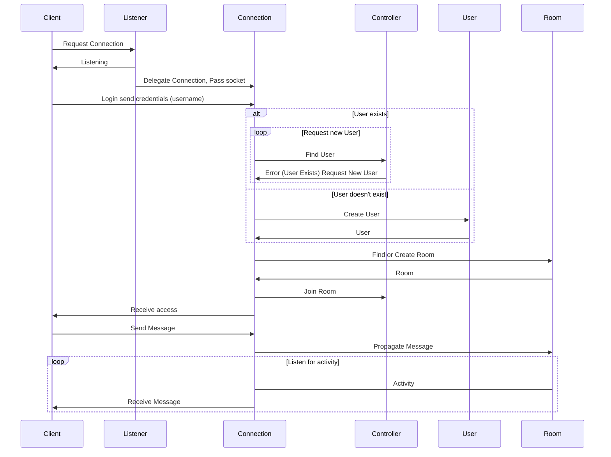

# Socket-based chat client

A single-node chat server that listens on a TCP port and implements the following user-facing functionality:
As a chat user
You can connect to the server using telnet or netcat
When I type something and press ENTER, all other connected chat users see my message.

## How to use

You can run the app with `make run` and run the tests with `make tests`, or using docker-compose `docker-compose run --rm test` and `docker-compose up web`
Another option is to test directly on Kubernetes with `tilt up`
The commands are:
- make run
- make tests
- docker-compose run --rm test
- docker-compose up web
- tilt up

To use the application, you can connect with `telnet 127.0.0.1 8080`

# Architecture

## Use Cases

- **User** will login via telnet or netcat
- **User** will be prompted for username
- **User** enters the default chat room
- **Room** announces new users entering
- **Service** has high availability

### Out of scope

- **User** registers for an account using credentials
- ** User** chooses chat room

### Constraints and assumptions

- If the connection drops, the User has to reconnect manually
- After entering the room user does no see old messages

## High-level Design

### Core Components

- The **Listener** component is the **Web Server** that listens for tcp connections
- When a **User** Connects, it delegates the socket to the ** connection** component
- The **Connection** is responsible for orchestrating the management of **User** and **Room** using the **Controller**
- **Controller** serves as registry for **User** and **Room**

### Next Steps And General Questions

- Add authentication, maybe use something like oath2
- Consider Kubernetes for deployment? not sure if Kubernetes is the best solution with erlang
- Is message caching required?
- Add chat commands
- Add timestamps on the messages
- Persit the messages
- Handle room creation dynamically and persist it
- Expose metrics

### Calculate usage (Questions?)

- How many users are we going to support?
- How can we profile the application?

## The Process

- I've never worked with registry before, and wrapping my head around it was very challenging
- I lost to much time trying to make an integration test work
- I have few doubts about Tasks, and not sure if I should have gone with a GenServer instead
- I initially was using GenStage for pub-sub, but I decided to implement everything by hand to get to know how things work
- I'm not sure about my pub-sub implementation
- Not sure about scaling, and how I would scale it leveraging all OTP features
- I focus the biggest part of my time in concern separation, I tried to make the code the most modular possible and extensible by consequences, so if I wanted I could add some features like commands and room creation
- Security is something that did not pass my mind, I suppose the erlang process are safe, but I did not account for code injection and in case I implement multiple rooms I can't be sure they are isolated. Also, no login and password
- This project is missing docs, specs and loggs, I should have added more of them

# My References

- [uses phoenix and orm](https://github.com/chrismccord/phoenix_chat_example)
- [The same phoenix chat example but his on uses channels](https://github.com/poeticoding/phoenix_chat_example)
- [using ranch](https://github.com/rviscarra/elixir-chat-example)
- [no separation of concerns](https://github.com/blbrodie/chattex)
- [Well organized example](https://github.com/beevik/chat)
- [gproc example](https://yos.io/2016/06/15/pub-sub-in-elixir/)
- [process registry socket](https://medium.com/pharos-production/elixir-process-registry-sockets-and-gproc-50c8eaf2ec2d)
- [process registry with gproc](https://www.brianstorti.com/process-registry-in-elixir/)
- [process registry by hand](https://www.brianstorti.com/process-registry-in-elixir/)
- [pubsub poc with 3 implementations](https://github.com/CultivateHQ/pubsub_spike)
- [pubsub with registry](https://github.com/al2o3cr/registry_pubsub)
- [pubsub with registry](https://github.com/rosetta-home/mdns/blob/master/lib/mdns/event_manager.ex)
- [pubsub with registry](https://github.com/rosetta-home/ssdp/blob/master/lib/ssdp/client.ex)
- [pubsub with registry twitch bot](https://github.com/chatstat/chatstat_twitch_irc/blob/master/lib/irc_bot/irc_bot.ex)
- [Replacing GenEvent with DynamicSupervisor + GenServer](https://gist.github.com/peerreynders/554dcfa75315a344f762b815ef2e8275)